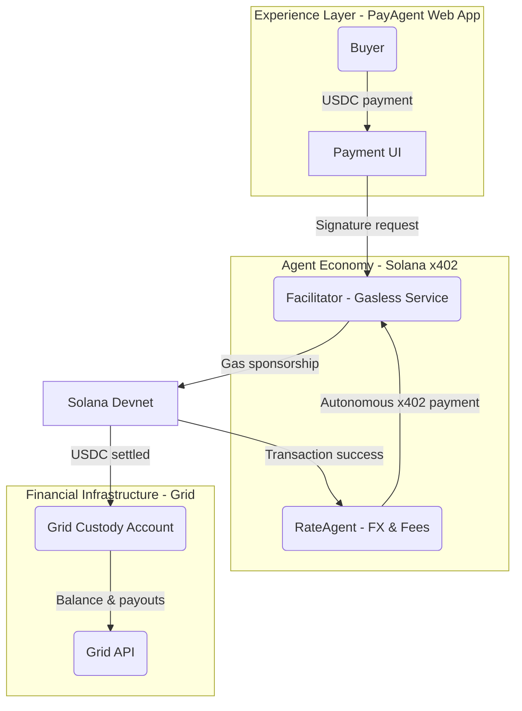

# Solana PayAgent Gateway: Powered by Grid

> An **Agentic Finance** payment gateway tailored for cross-border ecommerce. It combines the Solana x402 protocol with Grid custody so that merchants can accept USDC, settle with zero gas cost, and pay Agents on demand.

---

## 0. Judge Quickstart

1. **Clone & configure environment**: After cloning, run `cp env.template .env` and fill in required fields in the root `.env` file:
   - `GRID_API_KEY`, `GRID_ENVIRONMENT=sandbox`, `GRID_USER_ID`
   - `MERCHANT_GRID_ACCOUNT_ID`, `COMMISSION_GRID_ACCOUNT_ID`
   - `GRID_SIGNER_ADDRESS`, `GRID_SIGNER_PRIVATE_KEY`
   - `FACILITATOR_PRIVATE_KEY`
   - `RATE_AGENT_PRIVATE_KEY` (for RateAgent autonomous payments)
   - See `docs/integration/address-inventory.md` for detailed setup instructions.

2. **Install dependencies**:
   ```bash
   # Root directory
   npm install
   
   # Sub-applications
   cd apps/grid && npm install
   cd ../api && npm install
   cd ../web && npm install
   ```

3. **Provision the Sandbox business server**:
   - If `apps/x402-server/` doesn't exist, run: `cp -R reference/solana-x402-demo apps/x402-server`
   - Enter `apps/x402-server` and run: `npm install --legacy-peer-deps` (Node 18) or `npm install` (Node 20+)

4. **Verify Grid CLI**: `cd apps/grid && npm run dev -- accounts:balances <MERCHANT_GRID_ACCOUNT_ID>` to confirm Sandbox API Key permissions.

5. **Start the API**: `cd apps/api && npm run dev` (default port `4000`).

6. **Start the Kora stack (facilitator + fee payer)**:
   - **Environment variables**: Ensure root `.env` contains:
     - `RPC_URL=https://api.devnet.solana.com` (required by Kora RPC, not `SOLANA_RPC_URL`)
     - `KORA_PRIVATE_KEY` (Kora fee payer private key)
     - Note: If `.env` has `KORA_API_KEY=` (empty string), comment it out to avoid enabling authentication
   - **Kora RPC (port 8080)**:
     ```bash
     cd reference/kora
     . "$HOME/.cargo/env"
     RPC_URL=https://api.devnet.solana.com target/debug/kora \
       --config docs/getting-started/demo/server/kora.toml \
       rpc start \
       --signers-config docs/getting-started/demo/server/signers.toml \
       --port 8080
     ```
     Or use a symlink to read root `.env`:
     ```bash
     cd reference/kora
     ln -sf ../../.env .env
     ```
   - **Node Facilitator (port 3001)**:
     ```bash
     cd apps/facilitator-kora
     npm install
     npm run start
     ```

7. **Start the business server (402)**: `cd apps/x402-server && npm run dev`, verify `http://localhost:3000/api/premium-data` returns 402.
   - **Important**: Next.js Middleware cannot access `localhost` in Edge Runtime. Configure `NEXT_PUBLIC_FACILITATOR_URL` as ngrok URL or use proxy API Route.
   - If using ngrok: `ngrok http 3001`, then set `NEXT_PUBLIC_FACILITATOR_URL` to the ngrok public URL.

8. **Start the frontend**: `cd apps/web && npm run dev`, visit `http://localhost:3000/pay` to experience the payment flow.

9. **Automated end-to-end script**: From repo root, run `PAYMENT_SESSION_AMOUNT=1000000 node scripts/test-facilitator-flow.mjs --export-only`. The script chains `/quote → /session → /settle` and outputs commission breakdown.

10. **Test RateAgent autonomous payment**: Run `node scripts/test-agent-payment.mjs` to verify RateAgent automatically pays facilitator fees via x402 protocol after fetching exchange rates.

11. **Keep exploring**: `apps/README.md` provides subsystem overview, `docs/README.md` offers documentation index.

---

## 1. Vision & System Overview

- **North Star**: deliver a production-ready stablecoin payment entry point so that ecommerce buyers enjoy a Web2-like checkout while merchants receive USDC seamlessly.
- **Narrative pillars**:
  - **Solana x402 Hackathon**: Highlight `RateAgent` autonomy—the agent autonomously pays facilitator fees via x402 protocol after fetching exchange rates, demonstrating true Agentic Finance.
  - **Grid Grant Program**: Position Grid as the secure custody and fiat on/off-ramp backbone for enterprise-grade stablecoin management.
- **Three-layer architecture**:
  1. **Experience layer** (Next.js + shadcn UI front-end): drives buyer checkout, merchant status, and agent-triggered flows.
  2. **Agent economy layer** (Facilitator + Agents): based on the Gill `apps/x402-server` template to sponsor gasless transactions and invoke `RateAgent` per request.
  3. **Financial infrastructure layer** (Grid API + custody accounts): stores funds, exposes balances/settlements, and plugs into future fiat services.



---

## 2. Core Components & Stack

- **Front-end experience**
  - Framework: Next.js (App Router).
  - UI: shadcn/ui component library.
  - Client SDK: Corbits SDK handles client signatures and agent triggers.
  - Implementation: `apps/web/` provides the `/pay → /result` flow and talks to `/api/payments/quote | /session | /status`.
- **Agent economy**
  - Facilitator: The `apps/x402-server` template is included in the repo and can be used directly as a 402-protected business service.
  - Highlights: gasless sponsorship, x402 validation middleware, nonce replay protection, PM2 process management.
  - **RateAgent autonomous payments**: `RateAgent` integrates Switchboard for real-time exchange rates and **automatically pays facilitator fees via x402 protocol** after each rate fetch, demonstrating true Agentic Finance—agents with autonomous economic behavior.
- **Financial infrastructure**
  - SDK: `@sqds/grid@>=0.0.6`.
  - Capabilities: enterprise custody accounts, API auth, balance/history queries, future fiat settlement hooks.
  - Service: `apps/grid` wraps the Grid SDK in a TypeScript CLI utility.
- **Tooling**
  - Node.js >= 18, pnpm/npm as required by templates.
  - Solana CLI (Devnet airdrops & inspection).
  - TypeScript, ESLint, PM2.
  - `apps/grid` + `apps/api` Node services form the backbone.
  - Switchboard debug script: run `npm run rate:fetch [amount]` inside `apps/api` (amount in base units, e.g., `1000000` = 1 USDC).

---

## 3. Environment Checklist (Day 1)

1. **System dependencies**
   - Node.js 18+ (`node --version`).
   - pnpm or npm (must match template scripts).
   - Solana CLI (`solana --version`) pointing to Devnet.
2. **Keys & accounts**
   - Grid Sandbox `GRID_API_KEY` (apply through Grid support team).
   - Sandbox `GRID_USER_ID`, `GRID_SIGNER_ADDRESS`, `GRID_SIGNER_PRIVATE_KEY` (see `docs/integration/address-inventory.md`).
   - Sandbox Merchant / Commission Grid Accounts (create via `scripts/create-sandbox-accounts.mjs`).
   - Facilitator private key (Base58) — Devnet wallet for gas sponsorship.
   - RateAgent private key (Base58) — Dedicated wallet for autonomous x402 payments (`RATE_AGENT_PRIVATE_KEY`).
3. **Environment variables**
   - Create a root `.env` (do not commit) with:
     - `GRID_API_KEY`
     - `GRID_ENVIRONMENT=sandbox`
     - `GRID_USER_ID`
     - `MERCHANT_GRID_ACCOUNT_ID` / `MERCHANT_SOLANA_ADDRESS`
     - `COMMISSION_GRID_ACCOUNT_ID` / `COMMISSION_SOLANA_ADDRESS`
     - `GRID_SIGNER_ADDRESS` / `GRID_SIGNER_PRIVATE_KEY`
     - `FACILITATOR_PRIVATE_KEY`
     - `RATE_AGENT_PRIVATE_KEY` (for RateAgent autonomous payments)
     - `RATE_AGENT_PAYMENT_AMOUNT=1000` (default: 0.001 USDC in atomic units)
     - `SOLANA_RPC_URL=https://api.devnet.solana.com`
   - Template folders can keep their own `.env`; the root `.env` holds shared values.
   - `apps/grid` walks up the tree to load `.env`, so real credentials must be present.

---

## 4. Day 1: Grid × Facilitator Closed Loop

**Goal**: validate “Grid custody + gasless payment” with production-ready documentation.

### 4.1 Grid integration

1. Install the SDK: `npm install @sqds/grid` (>= 0.0.6).
2. Initialize the client:
   - Load `GRID_API_KEY` / `GRID_ENVIRONMENT` from `.env`.
   - Set `baseUrl=https://grid.squads.xyz`.
3. Account lifecycle:
   - Use `gridClient.createAccount` for facilitator/merchant accounts.
   - `gridClient.getAddresses` to retrieve Solana receiving addresses.
   - `gridClient.getAccountBalances` for ongoing monitoring.
4. Funds management:
   - Optionally create spending limits for controlled payouts.
   - Query history and export signatures to cross-check on Solana Explorer.

### 4.2 Facilitator template

1. Source: The repo includes `apps/x402-server/`, which can be used directly as a 402 Protected API (business service). To reset, copy from `reference/solana-x402-demo`.
2. Key settings:
   - Mirror `MERCHANT_SOLANA_ADDRESS` / `MERCHANT_GRID_ACCOUNT_ID` / `COMMISSION_GRID_ACCOUNT_ID` from Grid in `.env`.
   - Point `SOLANA_RPC_URL` to Devnet; set `NEXT_PUBLIC_API_BASE_URL` to `http://localhost:4000`.
   - Keep the facilitator funded with SOL (use `solana airdrop`).
3. Launch sequence:
   - `npm install --legacy-peer-deps` (Node 18) or upgrade to Node 20+ then `npm install`.
   - `npm run dev` (Next.js default port 3000), verify `/api/premium-data` returns 402.
4. Grid interoperability:
   - Facilitator pushes settlements directly into Grid accounts; back-end scripts can poll Grid APIs for balance updates.
   - Use the `apps/grid` CLI for debugging:
     ```bash
     cd apps/grid
     npm install
     npm run dev -- accounts:balances <MERCHANT_GRID_ACCOUNT_ID>
     ```

### 4.3 Validation loop

- Generate a test wallet and fund with Devnet SOL/USDC.
- Simulate client signatures via the front-end or Postman → facilitator sponsors gas → watch Grid balances update.
- Record every step and capture logs for documentation.

### 4.4 Automated settlement script

- From the repo root:
  ```bash
  npm install    # first run or after dependency updates
  PAYMENT_SESSION_AMOUNT=1000000 node scripts/test-facilitator-flow.mjs --export-only
  ```
- The script calls `/api/payments/quote → /session → /settle`, produces `curl-settle-body.json` (in root directory, excluded from git), and prints the settlement signature so `http://localhost:3000/result/<sessionId>` flips from `pending` to `settled`.

---

## 5. RateAgent Autonomous Payments (x402 Protocol)

**Core Innovation**: RateAgent demonstrates true Agentic Finance by autonomously paying facilitator fees via x402 protocol after fetching exchange rates from Switchboard. This showcases agents with independent economic behavior—a key requirement for "Best x402 Agent Application".

### 5.1 How It Works

1. **Rate Fetch**: When `/api/payments/quote` is called, RateAgent fetches real-time USDC/USD rates from Switchboard oracle.
2. **Autonomous Payment**: After successfully fetching a new rate (not from cache), RateAgent automatically:
   - Constructs an x402 Payment Request signed by the Agent wallet
   - Calls Facilitator `/verify` to validate the payment
   - Calls Facilitator `/settle` to complete the transaction
   - Records payment status (success/failure/skipped)
3. **Non-blocking**: Payment is executed asynchronously, ensuring API response time is not affected.

### 5.2 Configuration

- **Agent Wallet**: Configure `RATE_AGENT_PRIVATE_KEY` in `.env` (Base58 format)
- **Payment Amount**: Set `RATE_AGENT_PAYMENT_AMOUNT` (default: 1000 = 0.001 USDC in atomic units)
- **Funding**: Ensure the Agent wallet has sufficient USDC balance for payments

### 5.3 Testing

Run the test script to verify autonomous payments:
```bash
node scripts/test-agent-payment.mjs
```

This will:
- Check Facilitator availability
- Trigger a rate fetch (waiting for cache expiration)
- Verify the payment transaction on-chain
- Display transaction signature and Explorer link

### 5.4 Implementation Details

- **Service**: `apps/api/src/services/agentPaymentService.ts` handles x402 payment construction and execution
- **Integration**: `apps/api/src/rate/agent.ts` triggers payment after successful rate fetch
- **Data Model**: `PaymentSession.agentPayment` field tracks payment status

---

## 6. Day 3: Kora Facilitator Integration

> Goal: Use Kora to provide gasless x402 Facilitator, enabling `apps/x402-server` to use standard `.well-known/x402/*` routes for payment negotiation instead of simplified mocks. The flow aligns with official documentation. See Solana guide for example architecture.

### 6.1 Architecture Overview

- **Kora RPC (port 8080)**: Handles signing and fee sponsorship; `kora.toml` defines rates, network, and authentication policies.
- **x402 Facilitator (port 3001, recommended)**: Bridge service from Kora demo, implements `/verify`, `/settle`, `.well-known/x402/supported-payment-kinds` endpoints, avoiding conflicts with Next.js dev server (3000).
- **Protected business service (port 3000, Next.js)**: This repo's `apps/x402-server`, whose middleware queries Facilitator for payment methods and issues 402 responses.
- **API & Settlement service (port 4000)**: `apps/api`, handles Quote/Session/Settlement, aligned with Facilitator output signatures.

### 6.2 Environment Dependencies & Directories

1. **Rust + kora-cli**: From repo root, run `cd reference/kora && make install` to install executables.
2. **pnpm workspace**: Kora project uses pnpm internally, Node 20+ recommended. Run `pnpm -r install` to install demo dependencies.
3. **Configuration files**:
   - `reference/kora/docs/getting-started/demo/server/kora.toml`
   - `reference/kora/docs/getting-started/demo/server/signers.toml`
   - Custom `.env.kora` (recommended to copy to root `.env`), fill in:

| Variable | Description |
| --- | --- |
| `KORA_RPC_URL` | Default `http://localhost:8080`, Facilitator will call this RPC |
| `KORA_PRIVATE_KEY` | Fee payer private key (Base58 / JSON, follows `signers.toml` config) |
| `KORA_SIGNER_TYPE` | Default `memory`, adjust if using Turnkey/Privy |
| `PAYER_ADDRESS` | Kora payment account public key for receiving and gas sponsorship |
| `KORA_API_KEY` / `KORA_HMAC_SECRET` | Required if authentication enabled in `kora.toml` |
| `NEXT_PUBLIC_FACILITATOR_URL` | Point to `http://localhost:3001` (Kora Facilitator, avoid port conflict with Next.js) |
| `NEXT_PUBLIC_NETWORK` | e.g., `solana-devnet`, for `apps/x402-server` middleware network validation |
| `NEXT_PUBLIC_RECEIVER_ADDRESS` | Protected content receiver address, usually same as `MERCHANT_SOLANA_ADDRESS` |
| `NEXT_PUBLIC_CDP_CLIENT_KEY` | Coinbase Pay widget client key (placeholder for testing) |

> Note: `apps/x402-server` only reads `.env.local` / `.env.development` in its own directory. Ensure `NEXT_PUBLIC_*` variables exist there.

### 6.3 Startup Sequence

1. **Terminal A (Kora RPC)**:
     ```bash
     cd reference/kora
     . "$HOME/.cargo/env"
     cargo run -p kora-cli -- \
       --config docs/getting-started/demo/server/kora.toml \
       rpc start \
       --signers-config docs/getting-started/demo/server/signers.toml \
       --port 8080
     ```
2. **Terminal B (Facilitator Node service)**:
     ```bash
     cd apps/facilitator-kora
     npm install    # First run
     npm run start  # Or npm run dev for watch mode
     ```
   After startup, verify config with: `curl http://localhost:3001/.well-known/x402/supported-payment-kinds`
3. **Terminal C (Protected business service)**:
     ```bash
     cd apps/x402-server
     npm run dev
     ```
4. **Terminal D (Grid API + scripts)**:
     - `cd apps/api && npm run dev`
     - Return to repo root and run `node scripts/test-facilitator-flow.mjs --export-only` to verify full flow.

### 6.4 Troubleshooting

- `Unsupported network: undefined`: `NEXT_PUBLIC_NETWORK` not configured in `apps/x402-server/.env.local` or typo.
- `Failed to get supported payment kinds`: Facilitator not started correctly, or `.well-known/x402/supported-payment-kinds` returns 404. Check port conflicts and environment variables pointing to `apps/facilitator-kora`.
- Kora RPC authentication failure: Check if `kora.toml` `auth` section enables API Key/HMAC. Add `KORA_API_KEY`, `KORA_HMAC_SECRET` to `.env` if needed and reference in Facilitator config.

### 6.5 Documentation

- `docs/progress/day3-progress.md` records troubleshooting process and reminders to update environment variables before starting new 3000/3001/4000 processes.
- Reference: Solana official "x402 Integration with Kora - Complete Demo Guide" provides full Kora + Facilitator + Protected API example flow.

---

## 7. Front-end Baseline (shadcn plan)

- **Framework**: Next.js (App Router) with shadcn/ui; React Query stitches API calls.
- **Pages** (keep each file ≤ 200 lines):
  1. `Landing / Dashboard`: order flow summary and Grid balance snapshot.
  2. `Payment Flow`: buyer inputs amount → facilitator/Grid interaction → status updates.
  3. `Admin` (optional): agent call history and custody logs.
- **Data flow**:
  - Fetch `PaymentSession` (amount, nonce, facilitator URL) from the API.
  - Use Corbits SDK for client-side signing; post payload to the facilitator.
  - Poll for settlement and confirm USDC arrival via Grid APIs.
- **UX considerations**:
  - Straightforward steps for non-technical buyers.
  - Showcase the benefits of gasless payments and autonomous agent settlement.

---

## 8. Documentation & Collaboration

- Keep this README in sync with architecture, dependencies, APIs, and test plans.
- Store detailed progress logs, demos, and reports under `docs/` or companion documents.
- Diagrams and sequence charts belong in `docs/diagrams/` (to be created).
- Documentation is organized into `docs/architecture`, `docs/integration`, `docs/progress`, and `docs/reports`; see `docs/README.md` for an index.
- Raise and address code smells immediately (rigidity, duplication, cyclical deps, fragility, obscurity, data clumps, needless complexity).


