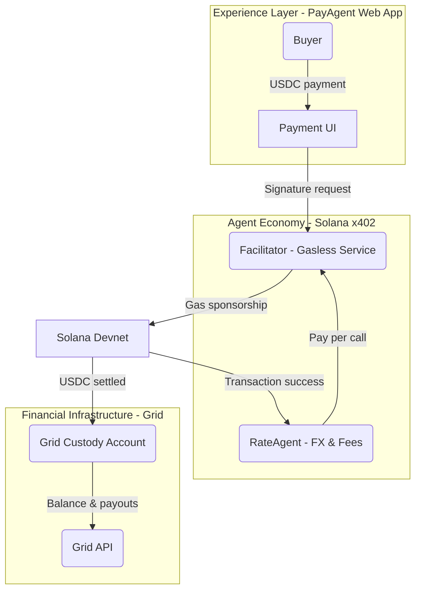

# Solana PayAgent Gateway: Powered by Grid

> An **Agentic Finance** payment gateway tailored for cross-border ecommerce. It combines the Solana x402 protocol with Grid custody so that merchants can accept USDC, settle with zero gas cost, and pay Agents on demand.

---

## 0. Judge Quickstart

1. **Clone & configure environment**: after `git clone`, run `cp env.template .env` in the repo root, then fill in `GRID_API_KEY`, `FACILITATOR_PRIVATE_KEY`, `MERCHANT_SOLANA_ADDRESS`, and other required fields.
2. **Install dependencies**:
   - Root: `npm install` (shared utilities).
   - `apps/grid`, `apps/api`, `apps/web`: run `npm install` inside each directory.
3. **Verify Grid CLI**: `cd apps/grid && npm run dev -- accounts:balances <GRID_ACCOUNT_ID>` to confirm the API key works.
4. **Start the API**: `cd apps/api && npm run dev` (listens on `http://localhost:4000` by default).
5. **Start the web app**: `cd apps/web && npm run dev`, then visit `http://localhost:3000/pay` for the payment journey.
6. **Automated end-to-end script**: from the repo root, run `PAYMENT_SESSION_AMOUNT=1000000 node test-facilitator-flow.mjs --export-only`. The script walks through `/quote → /session → /settle`, writes `curl-settle-body.json`, and prints the settlement signature.
7. **Keep exploring**: `apps/README.md` outlines the three apps, and `docs/README.md` indexes the documentation folders for deeper dives.

---

## 1. Vision & System Overview

- **North Star**: deliver a production-ready stablecoin payment entry point so that ecommerce buyers enjoy a Web2-like checkout while merchants receive USDC seamlessly.
- **Narrative pillars**:
  - **Solana x402 Hackathon**: highlight `RateAgent` autonomy and the gasless buyer experience.
  - **Grid Grant Program**: position Grid as the secure custody and fiat on/off-ramp backbone.
- **Three-layer architecture**:
  1. **Experience layer** (Next.js + shadcn UI front-end): drives buyer checkout, merchant status, and agent-triggered flows.
  2. **Agent economy layer** (Facilitator + Agents): based on the Gill `gill-node-solanax402` template to sponsor gasless transactions and invoke `RateAgent` per request.
  3. **Financial infrastructure layer** (Grid API + custody accounts): stores funds, exposes balances/settlements, and plugs into future fiat services.



---

## 2. Core Components & Stack

- **Front-end experience**
  - Framework: Next.js (App Router).
  - UI: shadcn/ui component library.
  - Client SDK: Corbits SDK handles client signatures and agent triggers.
  - Implementation: `apps/web/` provides the `/pay → /result` flow and talks to `/api/payments/quote | /session | /status`.
- **Agent economy**
  - Reference template: Gill `gill-node-solanax402` Facilitator (kept external; see `docs/integration/facilitator-setup.md` for instructions).
  - Highlights: gasless sponsorship, x402 validation middleware, nonce replay protection, PM2 process management.
  - Extension: `RateAgent` integrates Switchboard to price and charge facilitator fees per call.
- **Financial infrastructure**
  - SDK: `@sqds/grid@>=0.0.6`.
  - Capabilities: enterprise custody accounts, API auth, balance/history queries, future fiat settlement hooks.
  - Service: `apps/grid` wraps the Grid SDK in a TypeScript CLI utility.
- **Tooling**
  - Node.js >= 18, pnpm/npm as required by templates.
  - Solana CLI (Devnet airdrops & inspection).
  - TypeScript, ESLint, PM2.
  - `apps/grid` + `apps/api` Node services form the backbone.
  - Switchboard debug script: run `npm run rate:fetch [amount]` inside `apps/api` (amount in base units, e.g., `1000000` = 1 USDC).

---

## 3. Environment Checklist (Day 1)

1. **System dependencies**
   - Node.js 18+ (`node --version`).
   - pnpm or npm (must match template scripts).
   - Solana CLI (`solana --version`) pointing to Devnet.
2. **Keys & accounts**
   - Grid sandbox `GRID_API_KEY`.
   - Facilitator private key (Base58) — use a temporary Devnet wallet.
   - Grid business accounts for the facilitator and the merchant.
3. **Environment variables**
   - Create a root `.env` (do not commit) with:
     - `GRID_API_KEY` / `GRID_ENVIRONMENT=sandbox`
     - `FACILITATOR_PRIVATE_KEY`
     - `SOLANA_RPC_URL=https://api.devnet.solana.com`
     - `MERCHANT_SOLANA_ADDRESS`
   - Template folders can keep their own `.env`; the root `.env` holds shared values.
   - `apps/grid` walks up the tree to load `.env`, so real credentials must be present.

---

## 4. Day 1: Grid × Facilitator Closed Loop

**Goal**: validate “Grid custody + gasless payment” with production-ready documentation.

### 4.1 Grid integration

1. Install the SDK: `npm install @sqds/grid` (>= 0.0.6).
2. Initialize the client:
   - Load `GRID_API_KEY` / `GRID_ENVIRONMENT` from `.env`.
   - Set `baseUrl=https://grid.squads.xyz`.
3. Account lifecycle:
   - Use `gridClient.createAccount` for facilitator/merchant accounts.
   - `gridClient.getAddresses` to retrieve Solana receiving addresses.
   - `gridClient.getAccountBalances` for ongoing monitoring.
4. Funds management:
   - Optionally create spending limits for controlled payouts.
   - Query history and export signatures to cross-check on Solana Explorer.

### 4.2 Facilitator template

1. Source: clone the Gill `gill-node-solanax402` template (outside this repo); follow `docs/integration/facilitator-setup.md`.
2. Key settings:
   - Mirror `MERCHANT_SOLANA_ADDRESS` from Grid in the template `.env`.
   - Point `SOLANA_RPC_URL` to Devnet; set `SIMULATE_TRANSACTIONS=false` when ready to broadcast.
   - Keep the facilitator funded with SOL (use `solana airdrop`).
3. Launch sequence:
   - `npm install` → `npm run build` → `npm start`.
   - Verify `/health`, `/verify`, `/settle` endpoints.
4. Grid interoperability:
   - Facilitator pushes settlements directly into Grid accounts; back-end scripts can poll Grid APIs for balance updates.
   - Use the `apps/grid` CLI for debugging:
     ```bash
     cd apps/grid
     npm install
     npm run dev -- accounts:balances <GRID_ACCOUNT_ID>
     ```

### 4.3 Validation loop

- Generate a test wallet and fund with Devnet SOL/USDC.
- Simulate client signatures via the front-end or Postman → facilitator sponsors gas → watch Grid balances update.
- Record every step and capture logs for documentation.

### 4.4 Automated settlement script

- From the repo root:
  ```bash
  npm install    # first run or after dependency updates
  PAYMENT_SESSION_AMOUNT=1000000 node test-facilitator-flow.mjs --export-only
  ```
- The script calls `/api/payments/quote → /session → /settle`, produces `curl-settle-body.json`, and prints the settlement signature so `http://localhost:3000/result/<sessionId>` flips from `pending` to `settled`.

---

## 5. Front-end Baseline (shadcn plan)

- **Framework**: Next.js (App Router) with shadcn/ui; React Query stitches API calls.
- **Pages** (keep each file ≤ 200 lines):
  1. `Landing / Dashboard`: order flow summary and Grid balance snapshot.
  2. `Payment Flow`: buyer inputs amount → facilitator/Grid interaction → status updates.
  3. `Admin` (optional): agent call history and custody logs.
- **Data flow**:
  - Fetch `PaymentSession` (amount, nonce, facilitator URL) from the API.
  - Use Corbits SDK for client-side signing; post payload to the facilitator.
  - Poll for settlement and confirm USDC arrival via Grid APIs.
- **UX considerations**:
  - Straightforward steps for non-technical buyers.
  - Showcase the benefits of gasless payments and autonomous agent settlement.

---

## 6. Documentation & Collaboration

- Keep this README in sync with architecture, dependencies, APIs, and test plans.
- Store detailed progress logs, demos, and reports under `docs/` or companion documents.
- Diagrams and sequence charts belong in `docs/diagrams/` (to be created).
- Documentation is organized into `docs/architecture`, `docs/integration`, `docs/progress`, and `docs/reports`; see `docs/README.md` for an index.
- Raise and address code smells immediately (rigidity, duplication, cyclical deps, fragility, obscurity, data clumps, needless complexity).

---

## 7. Roadmap & Next Steps

- **Day 2 (preview)**: integrate Switchboard oracles, implement pay-per-use `RateAgent`, display live FX.
- **Day 3 (preview)**: atomic commission settlement, finalize README/demo assets, prepare dual submissions.
- **Beyond Day 3**:
  - Add fiat on/off-ramps through Grid APIs.
  - Expand the agent ecosystem (risk control, factoring agents, etc.).
  - Upgrade dashboards with better guidance and audit views.
  - Tighten `apps/api` and `apps/grid` integration and deployment scripts.

---

## 8. Change Log

| Date       | Update                                   | Notes                                                                                     |
| :--------- | :--------------------------------------- | :---------------------------------------------------------------------------------------- |
| 2025-10-30 | Initialized README                       | Added the overall blueprint, Day 1 tasks, and documentation guidelines.                   |
| 2025-10-30 | Added backend/grid module                | Introduced the Grid SDK wrapper and CLI (now relocated under `apps/grid`).                |
| 2025-10-30 | Drafted backend API                      | Planned REST endpoints and contract specs.                                                |
| 2025-11-09 | Completed Day 1 loop                     | `/api/payments/session → /settle` integration finished; documented signatures and scripts.|
| 2025-11-09 | Published Day 2 implementation plan      | Added `docs/day2-plan.md` covering RateAgent, front-end scaffolding, and reconciliation.  |
| 2025-11-10 | Integrated RateAgent with Switchboard    | `/api/payments/quote` shipped with caching and `npm run rate:fetch` tooling.              |
| 2025-11-11 | Finalized Day 2 automation script        | `test-facilitator-flow.mjs` drives `/quote → /session → /settle`, front-end reflects `settled`. |
| 2025-11-11 | Restructured repository                  | Moved to `apps/`, reorganized `docs/`, removed templates, added the Judge Quickstart.     |

> Append future updates to this table and reflect them in the relevant sections above.


