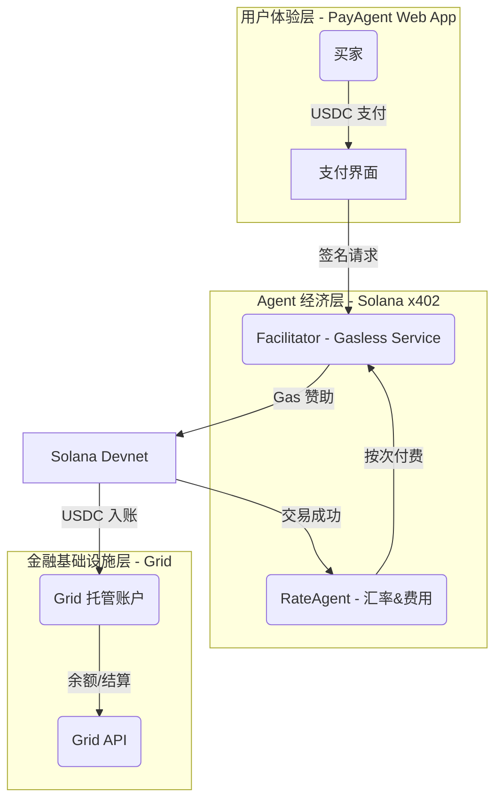

# Solana PayAgent Gateway: Powered by Grid

> 面向跨境电商的 **Agentic Finance** 支付网关：结合 Solana x402 协议与 Grid 托管能力，实现 Gasless 稳定币收付款、Agent 按次付费与自动化结算。

---

## 0. 评委快速上手

1. **克隆与环境变量**：`git clone` 仓库后进入根目录，执行 `cp env.template .env`，按模板填入 `GRID_API_KEY`、`FACILITATOR_PRIVATE_KEY`、`MERCHANT_SOLANA_ADDRESS` 等必需变量。
2. **安装依赖**：
   - 根目录：`npm install`（安装共享工具依赖）
   - `apps/grid`、`apps/api`、`apps/web`：分别运行 `npm install`
3. **Grid CLI 调试**：`cd apps/grid && npm run dev -- accounts:balances <GRID_ACCOUNT_ID>` 验证 API key 配置。
4. **启动后端 API**：`cd apps/api && npm run dev`，默认监听 `http://localhost:4000`。
5. **启动前端 Web**：`cd apps/web && npm run dev`，访问 `http://localhost:3000/pay` 体验支付流程。
6. **自动验证脚本**：回到根目录，执行 `PAYMENT_SESSION_AMOUNT=1000000 node test-facilitator-flow.mjs --export-only`，脚本会创建支付会话、生成 `curl-settle-body.json` 并调用 `/settle`。
7. **继续探索**：`apps/README.md` 梳理三大应用，`docs/README.md` 汇总文档分类，方便进一步评估。

---

## 1. 项目愿景与总体蓝图

- **终极目标**：打造一个可量产的稳定币支付入口，让跨境电商用户在 Web2 级体验下完成 USDC 支付与结算。
- **核心叙事**：
  - Solana x402 Hackathon：突出 `RateAgent` 的自主经济行为与 Gasless 体验。
  - Grid Grant Program：强调 Grid 作为安全托管与法币出入金的关键基础设施。
- **三层架构**：
  1. **用户体验层**（前端 Web App，计划基于 Next.js + shadcn UI）：模拟买家付款、卖家收款，驱动支付流程。
  2. **Agent 经济层**（Facilitator + Agents）：利用 `community/gill-node-solanax402` 模版，实现 Gasless 赞助与 `RateAgent` 按次调用。
  3. **金融基础设施层**（Grid API + 稳定币账户）：托管资金、提供结算与后续法币通道。



---

## 2. 核心组件与技术栈

- **前端体验层**
  - 框架：Next.js（计划）
  - UI：shadcn/ui 组件体系
  - 客户端 SDK：Corbits SDK（负责交易签名与 Agent 触发）
  - 实现：`apps/web/` 目录提供 `/pay → /result` 骨架，直接调用 `/api/payments/quote | /session | /status`
- **Agent 经济层**
  - 参考模板：Gill `gill-node-solanax402` Facilitator（已移至外部资源，步骤详见 `docs/integration/facilitator-setup.md`）
  - 核心特性：Gasless 赞助、x402 校验中间件、Nonce 防重放、PM2 进程管理
  - 扩展：`RateAgent` 集成 Switchboard 预言机，按次支付 Facilitator 费用
- **金融基础设施层**
  - SDK：`@sqds/grid@>=0.0.6`
  - 能力：企业级稳定币账户、API 鉴权、余额/交易查询、未来法币结算
  - 服务：`apps/grid` TypeScript 模块封装 Grid SDK + CLI 调试工具
- **开发与工具链**
  - Node.js >= 18、pnpm/npx（按模版需求补充）
  - Solana CLI（Devnet 测试、空投）
  - TypeScript、ESLint、PM2
  - `apps/grid` + `apps/api` Node 服务框架
  - Switchboard 调试脚本：在 `apps/api` 目录执行 `npm run rate:fetch [amount]`（`amount` 为最小单位，如 1000000 表示 1 USDC`)

---

## 3. 环境准备（Day 1 必备）

1. **系统依赖**
   - Node.js 18+（`node --version`）
   - pnpm 或 npm（与模板脚本保持一致）
   - Solana CLI（`solana --version`），默认连接 Devnet
2. **密钥与配置**
   - Grid Dashboard 申请的 `GRID_API_KEY`（sandbox 环境）
   - Facilitator 私钥（Base58），建议使用 Devnet 临时钱包
   - Grid 企业账户：至少需要 Facilitator 账户与卖家账户各一
3. **环境变量约定**
   - 在根目录创建 `.env`（勿提交），收录以下变量：
     - `GRID_API_KEY` / `GRID_ENVIRONMENT=sandbox`
     - `FACILITATOR_PRIVATE_KEY`
     - `SOLANA_RPC_URL=https://api.devnet.solana.com`
     - `MERCHANT_SOLANA_ADDRESS`（来自 Grid 账户地址）
   - 模版子目录保留各自的 `.env` 文件；根目录 `.env` 用于共享变量与前端。
  - `apps/grid` 会自动读取相对路径的 `.env`，确保真实值已填入。

---

## 4. Day 1：Grid × Facilitator 闭环设计

**目标**：完成 “Grid 账户托管 + Gasless 支付” 的最小可行验证，并建立文档化流程。

### 4.1 Grid 集成步骤

1. 安装 SDK：`npm install @sqds/grid`（版本 ≥ 0.0.6）
2. 初始化客户端：
   - 读取 `.env` 中的 `GRID_API_KEY`、`GRID_ENVIRONMENT`
   - 指定 `baseUrl=https://grid.squads.xyz`
3. 账户生命周期：
   - `gridClient.createAccount` 创建 Facilitator / 卖家账户
   - `gridClient.getAddresses` 获取 Solana 收款地址
   - `gridClient.getAccountBalances` 监控余额（后续用于风控与仪表盘）
4. 资金动作：
   - 创建 spending limit（可选，用于演示受控支付）
   - 查询交易历史、导出签名（配合 Solana Explorer 验证）

### 4.2 Facilitator 模版对接

1. 目录：参考 Gill 社区模板 `gill-node-solanax402`（已迁出主仓库，使用步骤详见 `docs/integration/facilitator-setup.md`）
2. 配置要点：
   - `.env` 中同步 Grid 提供的 `MERCHANT_SOLANA_ADDRESS`
   - `SOLANA_RPC_URL` 指向 Devnet；`SIMULATE_TRANSACTIONS=false`
   - Facilitator 私钥需具备足够 SOL（使用 `solana airdrop`）
3. 启动流程：
   - `npm install` → `npm run build` → `npm start`
   - 通过 `/health`、`/verify` 等接口验证服务状态
4. Grid 协同：
   - Facilitator 处理的交易直接打入 Grid 账户；可由后台脚本对接 Grid API，实时同步到账情况
   - 使用 `apps/grid` CLI 辅助调试：
     ```bash
     cd apps/grid
     npm install
     npm run dev -- accounts:balances <GRID_ACCOUNT_ID>
     ```

### 4.3 验证闭环

- 使用测试客户端生成器创建钱包并获取 Devnet SOL/USDC
- 前端或 Postman 模拟签名请求 → Facilitator 代付 Gas → 观察 Grid 余额变动
- 记录验证步骤与结果，存档于进度文档

### 4.4 自动结算脚本

- 在项目根目录运行：
  ```bash
  npm install    # 首次执行或依赖更新后
  PAYMENT_SESSION_AMOUNT=1000000 node test-facilitator-flow.mjs --export-only
  ```
  脚本会依次调用 `/api/payments/quote → /session → /settle`，生成 `curl-settle-body.json`，并输出结算后的 `transactionSignature`。配合前端 `http://localhost:3000/result/<sessionId>` 可即时看到状态从 `pending` 变为 `settled`。

---

## 5. 前端基线规划（shadcn 模版预案）

- **框架选型**：Next.js（App Router）；UI 采用 shadcn/ui；状态管理初期可用 React Query 处理 API 调用。
- **页面骨架**（后续实现时遵守单文件 ≤200 行）：
  1. `Landing / Dashboard`：展示订单流程、Grid 余额快照。
  2. `Payment Flow`：买家输入金额 → 调用 Grid/Facilitator 接口 → 展示交易状态。
  3. `Admin`（可选）：查看 Agent 调用记录、Grid 账户日志。
- **数据交互**：
  - 前端从后端获取 `PaymentSession`（包含金额、nonce、Facilitator 地址）
  - 调用 Corbits SDK 完成客户端签名；将签名包 POST 回 Facilitator
  - 监听交易结果；成功后轮询 Grid API 查询到账
- **UI/UX 约束**：
  - 简洁清晰，引导小白用户完成支付
  - 明确展示 Gasless 优势与 Agent 自主结算

---

## 6. 文档与协作规范

- README 始终同步最新架构、依赖、接口与测试策略；新功能上线后必须更新对应章节。
- 详细的每日进度、演示日志、测试报告请单独保存在 `docs/` 或现有方案文档中。
- 对应的架构图、时序图可保存在 `docs/diagrams/`（待建立）。
- 文档已按主题拆分至 `docs/architecture`、`docs/integration`、`docs/progress`、`docs/reports`，概览与索引详见 `docs/README.md`。
- 若发现架构坏味道（僵化、冗余、循环依赖等），需立即提出并与产品讨论是否优化。

---

## 7. 路线图与后续工作

- **Day 2**（预览）：集成 Switchboard 预言机、实现 `RateAgent` 按次支付与实时汇率展示。
- **Day 3**（预览）：原子化佣金结算、最终 README/演示材料、双重提交文案。
- **后续计划**：
  - 加入法币出入金流程（Grid API）
  - 扩展 Agent 生态（如风控、保理等智能代理）
  - 强化前端引导与审计仪表盘
  - 完善 `apps/api`、`apps/grid` 模块整合与部署脚本

---

## 8. 变更记录

| 日期 | 更新内容 | 说明 |
| :--- | :--- | :--- |
| 2025-10-30 | 初始化 README 框架 | 整体蓝图、Day 1 任务规划、文档规范 |
| 2025-10-30 | 新增 backend/grid 模块 | Grid SDK 封装、CLI 操作指引 |
| 2025-10-30 | 后端 API 草案 | REST 端点规划、接口契约说明 |
| 2025-11-09 | Day 1 闭环验证完成 | `/api/payments/session → /settle` 联调成功，记录链上签名与自动化脚本流程 |
| 2025-11-09 | 发布 Day 2 实施计划 | 新增 `docs/day2-plan.md`，细化 RateAgent、前端骨架与对账任务 |
| 2025-11-10 | RateAgent 集成 Switchboard | `/api/payments/quote` 上线，新增报价缓存与 `npm run rate:fetch` 调试脚本 |
| 2025-11-11 | Day 2 闭环脚本完成 | `test-facilitator-flow.mjs` 支持自动调用 `/quote → /session → /settle`，前端 Result 页可实时展示 `settled` 状态 |
| 2025-11-11 | 仓库结构重构 | 引入 `apps/` 目录、拆分 `docs/` 分类、移除模板引用并完善评委快速上手指南 |

> 后续更新请追加到此表格，并在章节内同步详细描述。


